# Readme

## 注意

- **本目录下的脚本请勿使用pycharm运行，用pycharm运行时可能无法打开仿真软件GUI界面，用python3运行即可**
- **脚本支持在Windows或Linux系统下运行，其中Windows下运行效果较好，Linux系统下不建议使用本脚本的仿真相关功能，可以自行设置shell和Makefile脚本**
- **脚本支持2017.2、2018.2和2019.2的vivado工程，其他版本未测试，其中对2017.2版本支持最好**

## 首次运行

**首次运行前需要：**

1. 保证vivado工程已经添加好**代码文件和IP核**，并设置好**第三方联调仿真库和仿真软件**

2. 使用文本编辑器修改代码文件`vivado_batch_sim.py`中第11~18行的Xilinx或Vivado软件安装目录常量，各常量具体含义如下：

   - **`GLOBAL_LINUX_XILINX_INSTALL_DIR`**：Linux系统下Xilinx文件夹所在目录路径
   - **`GLOBAL_WIN_XILINX_INSTALL_DIR`**：Windows系统下Xilinx文件夹所在目录路径
   - **`GLOBAL_VIVADO_INSTALL_DIR_SPARE_1`**：备用路径1，对应版本Vivado软件`Vivado`文件夹所在目录路径，当脚本在前面路径中无法找到对应版本的Vivado时，会在备用路径中查找
   - **`GLOBAL_VIVADO_INSTALL_DIR_SPARE_2`**：备用路径2
   
   代码位置如下所示：

  ```python
import sys
import os
import shutil
import chardet
from xml.dom.minidom import parse
from calcu_codefile_lines import VerilogFile

# 工程目录
GLOBAL_PROJ_DIR = '../'
# Linux系统Xilinx相关软件安装目录（Xilinx文件夹所在目录，需自行设置）
GLOBAL_LINUX_XILINX_INSTALL_DIR = '/opt/joat/'
# Windows系统Xilinx相关软件安装目录（Xilinx文件夹所在目录，需自行设置）
GLOBAL_WIN_XILINX_INSTALL_DIR = 'D:/'

# 备用Vivado安装目录路径：用于解决不同版本的Vivado软件未安装在同一分区内的情况 需自行设置
# 含义为Vivado文件夹所在目录路径
GLOBAL_VIVADO_INSTALL_DIR_SPARE_1 = 'D:/Xilinx/'
GLOBAL_VIVADO_INSTALL_DIR_SPARE_2 = 'C:/Xilinx/'
  ```

  根据自己当前系统类型（`Windows`或`Linux`）修改对应的常量为当前系统中`Xilinx`文件夹的所在位置，或者根据需要设置备用路径。

3. 将该文件夹放置于工程目录下（即`.xpr`文件所在目录下），使用`python3`运行`run.py`即可

## 功能说明

- 该脚本可以对`.xpr`工程文件进行`xml`解析并存储相关结果
- 该脚本可以调用对应版本的`vivado`软件生成当前工程的仿真相关脚本
- 该脚本可以对`vivado`软件生成的脚本文件中反人类的代码进行删改和添加**（Windows系统，`log -r ./*`等）**
- 该脚本可以将所在目录下名为`tb_wave.do`的波形脚本文件内容**替换**进`vivado`生成的波形脚本中
- 该脚本可以对删改后的脚本进行执行，调出仿真软件GUI运行仿真
- 该脚本可以对已经添加到工程中的**代码和约束文件**进行提取，拷贝到脚本所在目录下的`copy_code_files`文件夹下，**保持原有代码文件的目录结构**的同时，**将文件编码统一转换为`utf-8`**。
- 该脚本可以对已经添加到工程中的IP核的`xci`文件进行提取，以**每个`xci`文件一个独立同名文件夹**的形式拷贝到脚本所在目录下的`copy_ip_files`文件夹下，方便移植建立新的工程
- 该脚本可以调用`vivado`软件的`batch mode`分别对工程进行综合`synthesis`和实现`implement`
- 该脚本可以将当前可综合的工程生成EDF网表文件和对应的Verilog、VHDL源文件（相当于生成固核）
- 该脚本可以对**添加到工程中**的`Verilog`和`VHDL`代码文件进行**行数统计**，将详细结果写入到文本文件中

### 具体功能选项

> 1 ：退出
> 2 ：打开GUI工程
> 3 ：全流程仿真 - Compile Elaborate Simulate（可用于修改了代码之后重新仿真）
> 4 ：重新生成脚本，全流程仿真（用于添加了新的代码文件或IP核之后重新仿真）
> 5 ：单流程仿真 - Simulate（仅用于未做任何修改的仿真）
> 6 ：提取代码文件并转换为UTF-8编码 -> ./copy_code_files/
> 7 ：提取IP核xci文件 -> ./copy_ip_files/
> 8 ：进行综合 - Synthesis
> 9 ：进行实现 - Implement
> 10：生成EDF网表文件和对应的Verilog、VHDL源文件
> 11：重新解析工程xpr文件，并初始化参数
> 12：统计工程中Verilog和VHDL代码文件的行数 -> ./calcu_code_files_lines/

## 仿真功能运行展示

### 1. 脚本文件夹放置于工程目录

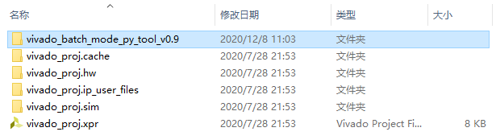

### 2. 第一次在该系统下运行前，查看该系统中`Xilinx`文件夹所在的安装目录

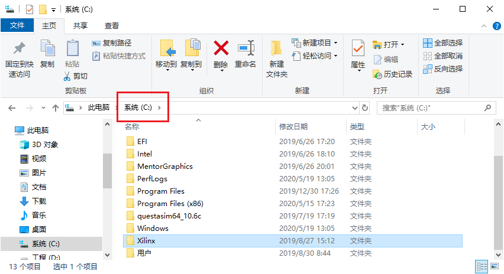

### 3. 将脚本代码中对应常量修改为`Xilinx`文件夹所在的安装目录

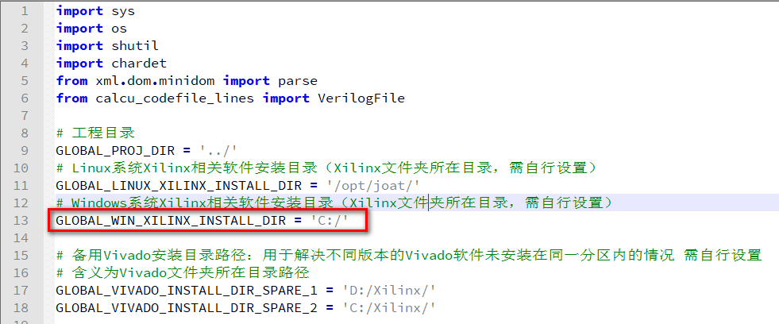

### 4. 如果有其他版本的Vivado安装在不同路径下

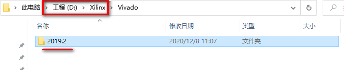

### 5. 将该版本的Vivado文件夹所在路径添加到备用路径中

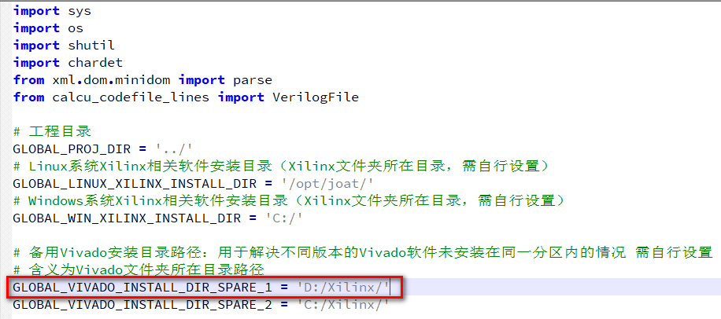

### 6. 安装`python3`后，使用pip安装第三方库chardet

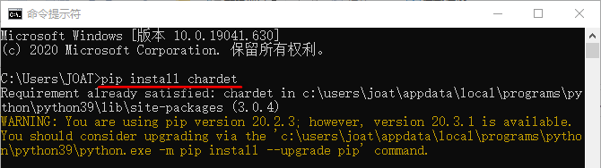

### 7. 打开`python3`的`IDLE`

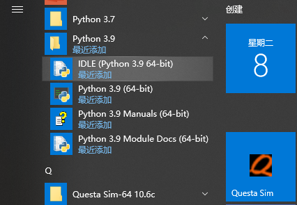

### 7.  打开run脚本

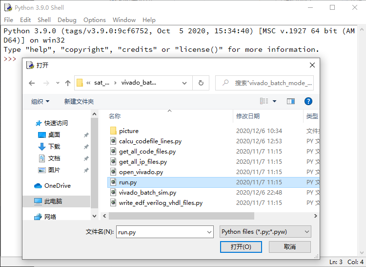

### 8. 按`F5`运行，出现交互界面

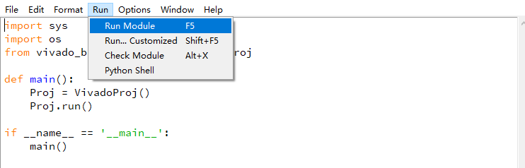

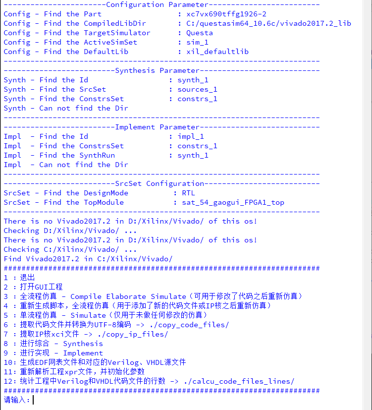

### 9. 输入2或3或4后回车，出现仿真界面，仿真时添加波形信号并保存至**脚本所在目录**，设置为`tb_wave.do`

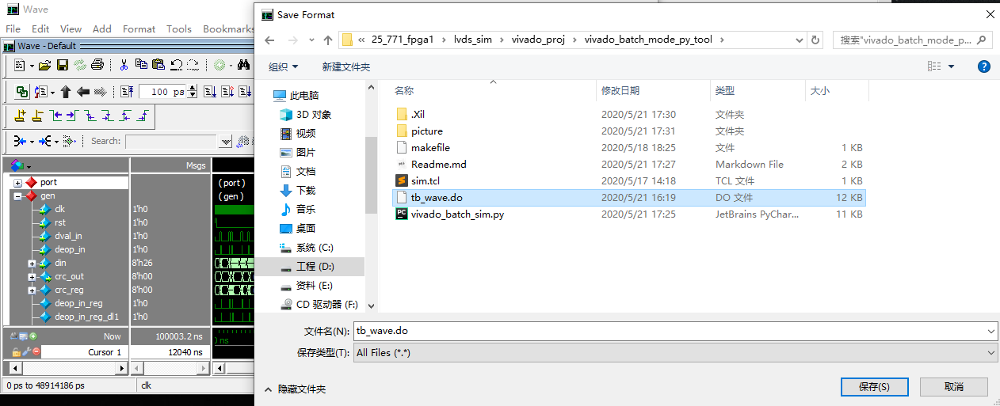

### 10. 关闭仿真软件

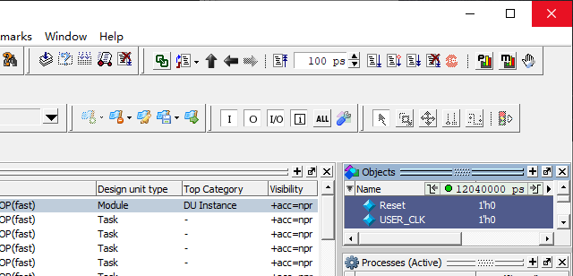

### 11. 仅修改代码后输入2后回车重新仿真

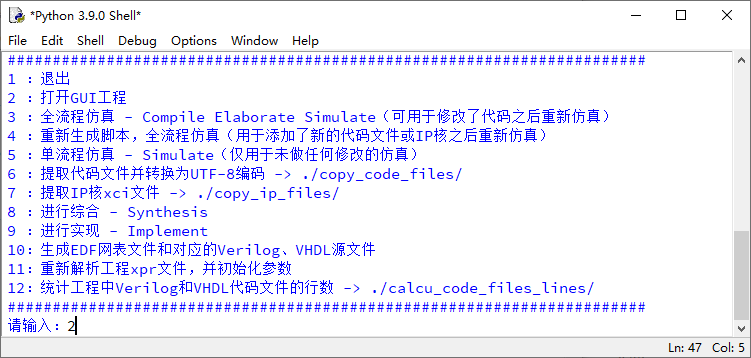

### 12. 可以看到仿真自动添加上次保存信号波形

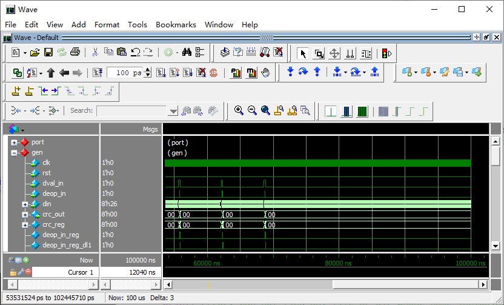